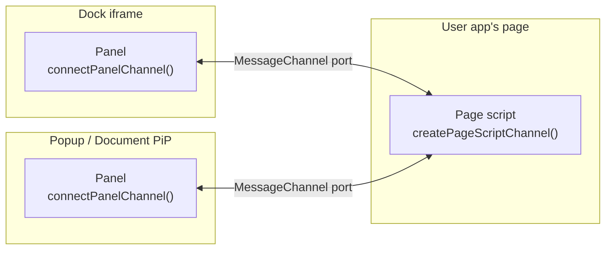

The in-page channel (`devframe/in-page-channel`) connects a devframe's page script to its panels entirely in the browser — typed events, calls, and page-script-authoritative shared state, with no server involved. It is how a live inspect-the-page loop (like the [a11y inspector](/plugins/a11y)'s scan/highlight cycle) works identically in dev and in a static build.

## Overview



The panel finds the page script with a same-origin `postMessage` handshake: it posts a versioned hello to its ancestor chain and `opener`, retrying with backoff until the page script answers by transferring a dedicated `MessageChannel` port. Boot order never matters, a reload of either side is just a re-handshake, and each connected panel gets its own port — a dock iframe and a picture-in-picture window can watch the same page script at once.

## The protocol

Declare the contract once, in a shared file both sides import — a pure type plus the channel-name constant:

```ts
// shared/protocol.ts
import type { InPageChannelProtocol } from 'devframe/in-page-channel'

export const MY_CHANNEL = 'devframes:plugin:my-tool'

export interface MyChannelProtocol extends InPageChannelProtocol {
  pageScript: { // implemented by the page script, called by panels
    highlight: (selector: string) => void
    measure: (selector: string) => { width: number, height: number }
  }
  panel: { // implemented by panels, called by the page script
    flash: (message: string) => void
  }
  sharedStates: {
    state: { selections: string[] }
  }
}
```

Channel names are namespaced with the devframe id, like RPC ids. Function names stay bare — the channel name already scopes them.

## The page script endpoint

Functions are defined with `defineChannelFunction` — the same authoring shape as `defineRpcFunction` (`name`, `type`, Standard-Schema `args`/`returns`, `jsonSerializable`, `handler`), narrowed to the browser. Define each side's functions in that side's source files; the shared protocol file carries only types.

```ts
import type { MyChannelProtocol } from '../shared/protocol'
// inject/index.ts — runs in the user app's page
import { createPageScriptChannel, defineChannelFunction } from 'devframe/in-page-channel'
import { MY_CHANNEL } from '../shared/protocol'

const channel = createPageScriptChannel<MyChannelProtocol>({
  name: MY_CHANNEL,
  functions: [
    defineChannelFunction({
      name: 'highlight',
      type: 'event', // fire-and-forget
      jsonSerializable: true,
      handler: (selector: string) => drawRing(document.querySelector(selector)),
    }),
    defineChannelFunction({
      name: 'measure', // request/response (the default `query` type)
      handler: (selector: string) => {
        const rect = document.querySelector(selector)!.getBoundingClientRect()
        return { width: rect.width, height: rect.height }
      },
    }),
  ],
})

channel.callEvent('flash', 'scanning…') // fans out to every connected panel
channel.events.on('panel:connected', panel => console.log(panel.id))
channel.events.on('panel:disconnected', () => pauseWorkIfNobodyWatches())
```

`callEvent` on the page script is 1:N — it fans out to every connected panel, and panels that don't implement the function ignore it. Request/response *to* a panel goes through an explicit peer handle: `channel.panels[0].call('flash', '…')`.

## The panel endpoint

```ts
import type { MyChannelProtocol } from '../shared/protocol'
// spa/main.ts — the devtools SPA (dock iframe, popup, or PiP)
import { connectPanelChannel } from 'devframe/in-page-channel'
import { MY_CHANNEL } from '../shared/protocol'

const channel = connectPanelChannel<MyChannelProtocol>({ name: MY_CHANNEL })

channel.callEvent('highlight', '.hero') // buffered until connected
const size = await channel.call('measure', '.hero')
```

## Shared state

The channel's shared-state layer mirrors [`rpc.sharedState`](/guide/shared-state) — same `SharedState<T>` handle, same accessor — with the page script playing the server's role as rendezvous and authority. Its first `get` of a key must provide the initial value; panels are seeded automatically on connect (including late joiners and re-connects) and converge through syncId-deduplicated patches.

```ts
// Page script — the authority:
const state = await channel.sharedState.get('state', { initialValue: { selections: [] } })
state.mutate((draft) => {
  draft.selections.push('.hero')
})

// Panel — a live mirror:
const state = await channel.sharedState.get('state')
state.on('updated', fullState => render(fullState))
state.value() // Immutable<T> snapshot
```

Without an `initialValue`, a panel's `get` resolves once the first replay arrives — so `render(state.value())` never sees a half-initialized value. Keep values serializable: they cross a structured-clone boundary on every sync.

## Errors and fallbacks

Every failure mode is a coded `InPageChannelError` (`error.code`) with a message that explains itself:

| Code | When | What to do |
|------|------|------------|
| `timeout` | A call outlived `callTimeoutMs` (default 15s), or `whenConnected(ms)` expired | The message carries the endpoint status — `connecting` usually means the page script isn't loaded in this context |
| `closed` | The endpoint was closed with calls pending | Expected during teardown |
| `not-serializable` | A `jsonSerializable: true` payload contained a non-JSON value | The message names the offending path (e.g. `its arguments[0].nodes[2]` is a Map) |
| `not-cloneable` | The port refused to clone a payload (`DataCloneError`) | Strip functions/DOM nodes/reactivity proxies — or declare `jsonSerializable: true` for the precise error above |
| `invalid-args` | Incoming arguments failed their Standard-Schema validation | The message lists the schema issues |
| `state-uninitialized` | The page script read a shared state before providing its `initialValue` | Initialize on first access |

The panel endpoint's connection lifecycle is explicit, so a panel renders a useful fallback instead of hanging:

- `channel.status` is `connecting` → `connected` → (`connecting` on port loss) → `closed`, with `events.on('status:updated', …)` for reactivity.
- While `connecting`, `call()` is queued (and still subject to its deadline) and `callEvent()` is buffered (up to `eventBufferLimit`, oldest dropped with a warning) — both flush on connect.
- A page script may legitimately never appear (the panel opened standalone, the user app not instrumented). Race `whenConnected(timeoutMs)` to show a "load the page script" empty state:

```ts
try {
  await channel.whenConnected(3000)
}
catch {
  renderEmptyState('Add the page script to your app to see live data.')
}
```

Recovery is automatic: a dead port (detected by the port's `close` event or the built-in heartbeat) returns the panel to `connecting` and resumes the handshake, so a host-page reload reconnects a popup panel by itself.

## Reactivity and serialization

Payloads cross the port with structured clone. Framework reactivity wrappers don't survive it — unwrap them before sending, either in handlers or once per endpoint with the `serialize`/`deserialize` hooks:

```ts
import { toRaw } from 'vue'

const channel = connectPanelChannel<MyChannelProtocol>({
  name: MY_CHANNEL,
  serialize: value => toRawDeep(value), // applied to every outgoing argument and result
})
```

Declaring a function `jsonSerializable: true` additionally enforces strict JSON on its payloads at the receiving endpoint, turning a would-be silent coercion or cryptic `DataCloneError` into a coded error naming the offending path.

## Multiple tabs

The same app open in two tabs means two page scripts on one origin. Each page script carries a per-tab instance id (persisted in `sessionStorage`), and handshakes are targeted `postMessage` — so a dock panel always pairs with its own tab's page script. A panel can also pin explicitly:

```ts
connectPanelChannel<MyChannelProtocol>({ name: MY_CHANNEL, instanceId })
```

## Custom transports

Both endpoints accept a pre-established `MessagePort`, bypassing the handshake — for custom topologies and tests:

```ts
const { port1, port2 } = new MessageChannel()
pageScript.addPanelPort(port1)
const panel = connectPanelChannel<MyChannelProtocol>({ name: MY_CHANNEL, transport: port2 })
```

## When to use the in-page channel vs RPC

| Use the in-page channel for | Use [RPC](/guide/rpc) for |
|----------------------------|---------------------------|
| Page script ↔ panel loops (highlight, scan, measure) | Anything involving the node side (files, processes, storage) |
| Working identically in dev and static builds | Data that must survive the tab (server owns it) |
| Same-tab, same-origin surfaces | Cross-origin external viewers, remote panels |

The a11y inspector uses both: the scan/highlight loop rides the in-page channel, while `get-config` is a `static` RPC resolved over WebSocket in dev and from the baked dump in a static build.
