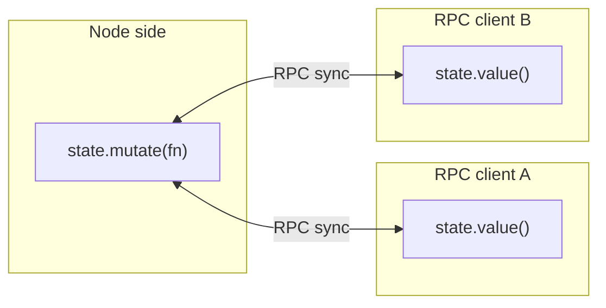

Shared state is observable, immutable-by-default state synced between the node side and every RPC client, surviving reconnects - a new RPC client gets the snapshot.

## Overview



## Creating state

A [scoped context](/guide/scoped-context)'s `rpc.sharedState(key, options)` namespaces it:

```ts
import { defineDevframe } from 'devframe'

export default defineDevframe({
  id: 'my-tool',
  name: 'My Tool',
  async setup(ctx) {
    const my = ctx.scope('my-tool')

    const state = await my.rpc.sharedState('state', { // -> my-tool:state
      initialValue: {
        count: 0,
        items: [] as { id: string, name: string }[],
      },
    })

    console.log(state.value().count) // 0
  },
})
```

The scope prefixes `<devframe-id>:` (wrapping `ctx.rpc.sharedState.get(...)`), so pass a bare key.

## Reading

`state.value()` returns an immutable snapshot.

```ts
const current = state.value()
console.log(current.count)
// current.count = 1 // ✗ TypeScript error - snapshot is Immutable<T>
```

## Mutating

Pass a recipe to `state.mutate()`:

```ts
state.mutate((draft) => {
  draft.count += 1
  draft.items.push({ id: 'a', name: 'Alpha' })
})
```

Devframe applies the recipe to a draft, emits `updated` (with `SharedStatePatch[]` if enabled), and broadcasts to RPC clients; a `syncIds` set keeps mutations idempotent on replay.

## Patches (advanced)

Enable patches for minimal network diffs; `updated` then carries `Patch[]`:

```ts
const state = await ctx.rpc.sharedState.get('my-tool:big-state', {
  initialValue: largeTree,
  /** sharedState-level enablePatches is opt-in: */
  sharedState: createSharedState({ initialValue: largeTree, enablePatches: true }),
})
```

## Subscribing

```ts
state.on('updated', (fullState, patches, syncId) => {
  // `patches` is populated only when enablePatches is set.
})
```

## Client-side access

The same key is on the browser RPC client, scoped identically; browser-side mutations round-trip the node side, keeping `state.value()` authoritative.

```ts
import { connectDevframe } from 'devframe/client'

const my = (await connectDevframe()).scope('my-tool')

const state = await my.rpc.sharedState('state') // -> my-tool:state

console.log(state.value().count)

state.mutate((draft) => {
  draft.count += 1
})
```

## Enumerating keys

Both sides expose `keys()` and `onKeyAdded`:

```ts
for (const key of ctx.rpc.sharedState.keys()) {
  console.log(key)
}

const unsubscribe = ctx.rpc.sharedState.onKeyAdded((key) => {
  console.log('new shared-state key:', key)
})
```

Protocol adapters (e.g. [MCP](/guide/agent-native)) surface shared state as dynamic resources.

## Type-safe keys

Augment `DevframeRpcSharedStates` to type each key once; lookups stay typed:

```ts
declare module 'devframe' {
  interface DevframeRpcSharedStates {
    'my-tool:state': {
      count: number
      items: { id: string, name: string }[]
    }
  }
}
```

## When to use shared state vs RPC

| Use shared state for | Use RPC for |
|----------------------|-------------|
| Long-lived UI state (selections, filters, expanded nodes) | One-shot queries (`get-modules`, `read-file`) |
| Coordination across RPC clients | Commands / actions with side effects |
| Data that should reappear after reconnect | Event streams (prefer `broadcast` / `callEvent`) |

For actions and events, use `ctx.rpc.register` + `broadcast` ([RPC](/guide/rpc)).
