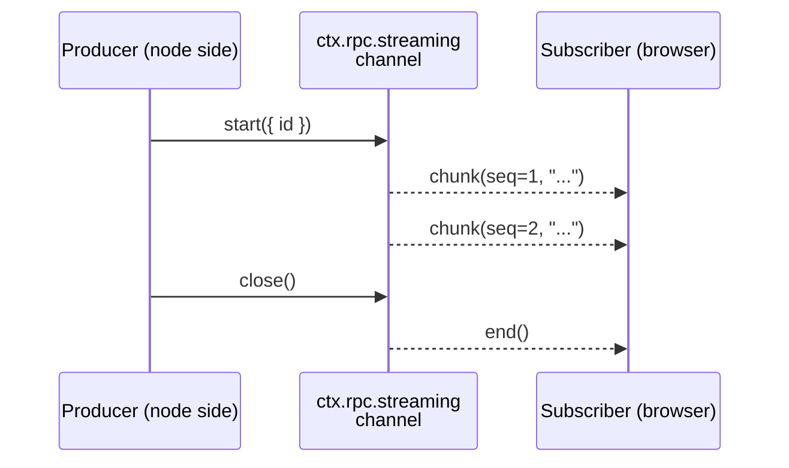

Streaming channels push chunk-style data from the node side to the browser side over the RPC socket.

## Overview



A **channel** owns a wire namespace; each `channel.start()` makes one **stream** keyed by an id (auto unless passed), joined by `(channelName, id)`.

## Defining a channel

```ts
import { defineDevframe, defineRpcFunction } from 'devframe'
import * as v from 'valibot' // npm i valibot

export default defineDevframe({
  id: 'my-tool',
  name: 'My Tool',
  async setup(ctx) {
    const my = ctx.scope('my-tool')

    const channel = my.rpc.streaming.create<string>('chat', { // -> my-tool:chat
      replayWindow: 256,
    })

    my.rpc.register(defineRpcFunction({
      name: 'start-chat', // -> my-tool:start-chat
      type: 'action',
      jsonSerializable: true,
      args: [v.object({ prompt: v.string() })],
      returns: v.object({ streamId: v.string() }),
      handler: async ({ prompt }) => {
        const stream = channel.start()
        ;(async () => {
          for await (const token of fakeLLM(prompt, { signal: stream.signal })) {
            stream.write(token)
          }
          stream.close()
        })()
        return { streamId: stream.id }
      },
    }))
  },
})
```

## Producing — three APIs, one stream

```ts
const stream = channel.start({ id: 'optional-explicit-id' })

// Imperative — minimal, hand-rolled producers
stream.write(chunk)
stream.error(err) // terminal failure
stream.close() // terminal success
stream.signal // AbortSignal — flips when consumers cancel
stream.id // string — what RPC clients subscribe to

// Web Streams — pipe any ReadableStream<T> in:
sourceReadable.pipeTo(stream.writable, { signal: stream.signal })

// Convenience — start + pipe in one call:
const stream = await channel.pipeFrom(sourceReadable)
```

### Node stream interop

Node 17+ converters:

```ts
import { Readable, Writable } from 'node:stream'

// Pipe a Node Readable into the streaming channel
sourceNodeReadable.pipe(Writable.fromWeb(stream.writable))

// Pipe the channel out to a Node Writable
Readable.fromWeb(reader.readable).pipe(targetNodeWritable)
```

## Consuming — `for await` or `pipeTo`

The reader is an `AsyncIterable<T>` also exposing `.readable` (`ReadableStream<T>`), one per reader.

```ts
import { connectDevframe } from 'devframe/client'

const my = (await connectDevframe()).scope('my-tool')
const { streamId } = await my.rpc.call('start-chat', {
  prompt: 'Hello',
})

const reader = my.rpc.streaming.subscribe<string>('chat', streamId) // -> my-tool:chat

// Async iterable — the simplest consumer pattern
for await (const token of reader)
  appendToken(token)

// Or pipe to a DOM-side WritableStream
await reader.readable.pipeTo(downloadWritable)

reader.cancel() // sends cancel upstream; the node-side stream.signal flips
```

## Lifecycle and cancellation

| Event | Node side | Browser side |
|-------|--------|--------|
| `stream.close()` / `stream.error(err)` | broadcasts `end` | `for await` resolves or throws |
| `reader.cancel()` | aborts `stream.signal` on **last**-subscriber cancel | `for await` ends |
| WS disconnects | aborts `stream.signal` on **last**-subscriber drop | reader survives, resubscribes on re-trust |
| `chat` panel closes | cancels upstream | — |

## Browser-to-node uploads

In reverse: an RPC call allocates the id; events carry chunks.

```ts
// Node side — typically inside an action handler
ctx.rpc.register(defineRpcFunction({
  name: 'my-tool:upload-file',
  type: 'action',
  args: [v.object({ name: v.string() })],
  returns: v.object({ uploadId: v.string() }),
  handler: async ({ name }) => {
    const reader = channel.openInbound()

    // Process chunks asynchronously — the action returns immediately
    // so the browser side can start uploading.
    ;(async () => {
      const file = createWriteStream(name)
      for await (const chunk of reader)
        file.write(chunk)
      file.close()
    })()

    return { uploadId: reader.id }
  },
}))
```

```ts
// Browser side
const { uploadId } = await my.rpc.call('upload-file', {
  name: 'capture.bin',
})
const upload = my.rpc.streaming.upload<Uint8Array>('files', uploadId) // -> my-tool:files

// Imperative
upload.write(chunk1)
upload.write(chunk2)
upload.close()

// Or pipe a Web ReadableStream straight in:
fileReadable.pipeTo(upload.writable, { signal: upload.signal })
```

Lifecycle mirrors outbound: `upload.signal` aborts on `reader.cancel()` (broadcasting `upload-cancel`), `upload.error(err)` throws inside its `for await`, and an RPC-client disconnect exits with `UploadDisconnected`. Each `openInbound()` id is point-to-point — one producer, no fan-in or replay.

## Replay on reconnect

With `replayWindow: N`, the node side keeps the last `N` chunks; a resubscribing RPC client sends its highest seen sequence and the node side replays newer ones.

```ts
my.rpc.streaming.create<string>('chat', { // -> my-tool:chat
  replayWindow: 256, // chunks to retain per stream id
  closedStreamRetention: 30_000, // ms to hold closed streams for late subscribers
})
```

`closedStreamRetention` defaults to 30 s when `replayWindow > 0`.

## Backpressure

The RPC client keeps a bounded queue per subscription (`highWaterMark`, default 256); when the consumer falls behind, the oldest chunk drops, logging [`DF0029`](/errors/DF0029).

```ts
const reader = my.rpc.streaming.subscribe('chat', id, { // -> my-tool:chat
  highWaterMark: 1024, // raise if you expect bursts the consumer can recover from
})
```

## Streaming vs events vs shared state

| Streaming | `event`-typed RPC | Shared state |
|-----------|-------------------|--------------|
| Token/chunk feeds (LLM deltas, logs) | Payload-less notifications (`refresh`, `clear`) | Long-lived UI state |
| Per-call lifecycles, cancellation | Cross-cutting signals | Snapshots surviving reconnect |
| Replay on reconnect | Fire-and-forget | Diff-based sync |
| Browser→node uploads (files, mic) | | |

## Reference

- `RpcStreamingHost`, `RpcStreamingChannel<T>`, `StreamSink<T>`, `StreamReader<T>` in `devframe/types`.
- [`examples/streaming-chat`](https://github.com/devframes/devframe/tree/main/examples/streaming-chat).
- Errors: [`DF0029`](/errors/DF0029) (overflow), [`DF0030`](/errors/DF0030) (unknown id), [`DF0031`](/errors/DF0031) (write to closed), [`DF0032`](/errors/DF0032) (name collision).
