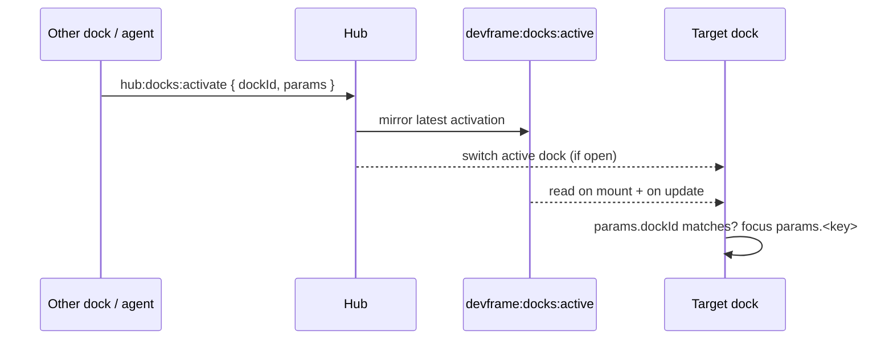

# Deep Linking

Send a user straight to a specific view inside a devframe — a particular terminal session, a particular data source — from another dock, an agent, or a copied URL. There are two paths: the hub relays a **dock activation** to focus a dock in place, and a standalone SPA reads its own **URL hash** to restore the view on load.

## Focusing a dock inside a hub

The viewer's active dock is client-local state — which dock is on screen lives in the shell page, not in shared state. A mounted devframe runs in its own iframe on its own RPC client, so it reaches that selection through the hub. `hub:docks:activate` switches the active dock and carries an opaque `params` bag the target dock reads:

```ts
await rpc.call('hub:docks:activate', {
  dockId: 'devframes:plugin:data-inspector',
  params: { sourceId: 'my-plugin:store' },
})
```

The hub broadcasts the request live and mirrors it into the [`devframe:docks:active`](/guide/shared-state) shared-state slot, so a dock that mounts *because* of the switch still converges on the request instead of missing the broadcast. The target dock subscribes to that slot, filters on its own `dockId`, and reads the `params` field it recognizes — see [Cross-iframe dock activation](/guide/hub#cross-iframe-dock-activation) for the full relay.



Focus is one-shot and tolerant: the [terminals dock](/plugins/terminals#focusing-a-session) reads `params.sessionId`, the [Data Inspector](/plugins/data-inspector#deep-linking) reads `params.sourceId`, and a target that names something not yet registered waits for it to appear, then fires once — the user's own clicks stay honored afterward. An id that never arrives is a no-op; a `dockId` the viewer doesn't know degrades to a warning ([DF8107](/errors/DF8107)).

## Standalone URL deep links

Running standalone — a CLI server, a static build — a devframe SPA owns its own URL. Encode the shareable view in the **hash** (`#…`): it round-trips through a copied link, survives a reload, and stays clear of the query string that the server handshake (`?devframe_auth_token=`) rides on. Parse it with `URLSearchParams` for a familiar key/value shape:

```ts
// read on load
const params = new URLSearchParams(location.hash.replace(/^#/, ''))
const sourceId = params.get('source')

// write back, without stacking history entries
history.replaceState(history.state, '', `#${params.toString()}`)

// react to back/forward and manual edits
window.addEventListener('hashchange', applyState)
```

The [terminals dock](/plugins/terminals#deep-linking) keys a single selection as `#id=<sessionId>`; the [Data Inspector](/plugins/data-inspector#deep-linking) encodes its whole workbench — `#source=…&query=…` plus filter and auto-rerun flags — so a link reproduces an exact query result. Read the hash once at boot to restore the view, then keep it in sync as the user works. `replaceState` writes never fire `hashchange`, so the boot read, the live listener, and the write-back compose without looping.

Keep credentials out of anything shareable. A pre-shared handshake token belongs in the query string and should be scrubbed from the address bar as soon as it's read, the way the Data Inspector consumes `?devframe_auth_token=` — never in the hash a user copies to share a view.
