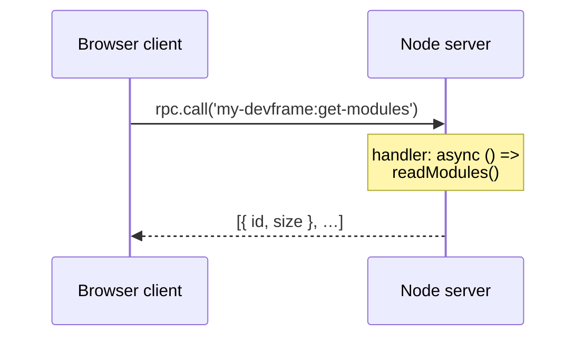

# RPC

Type-safe, bidirectional RPC built on [`birpc`](https://github.com/antfu/birpc), validated against any [Standard Schema](https://standardschema.dev/) validator. Dev runs over WebSocket; build/SPA serves a pre-computed static dump.

## Overview


```mermaid
sequenceDiagram
  participant Client as Browser client
  participant Server as Node server

  Client->>Server: rpc.call('my-devframe:get-modules')
  Note over Server: handler: async () =><br/>readModules()
  Server-->>Client: [{ id, size }, …]
```

## Defining a function

```ts
import { defineRpcFunction } from 'devframe'
import * as v from 'valibot' // npm i valibot (or use zod / arktype)

export const getModules = defineRpcFunction({
  name: 'get-modules', // bare — the scope namespaces it to `my-devframe:get-modules`
  type: 'query',
  args: [v.object({ limit: v.number() })],
  returns: v.array(v.object({ id: v.string(), size: v.number() })),
  setup: ctx => ({
    handler: async ({ limit }) => {
      // `ctx` is the full DevframeNodeContext.
      return loadModules().slice(0, limit)
    },
  }),
})
```

Register it via a [scoped context](./scoped-context) — `ctx.scope(id)` auto-namespaces ids:

```ts
import { defineDevframe } from 'devframe'
import { getModules } from './rpc/functions/get-modules'

export default defineDevframe({
  id: 'my-devframe',
  name: 'My Devframe',
  setup(ctx) {
    const my = ctx.scope('my-devframe')
    my.rpc.register(getModules)
  },
})
```

### Naming convention

Scope with your devframe id, then a kebab-case action: `my-devframe:get-modules`.

### Function types

| Type | Description | Cached | Static Dump |
|------|-------------|--------|-------------|
| `query` | Read operation that can change over time. | Opt-in via `cacheable` | Manual (declare `dump`) |
| `static` | Data that never changes for a given input. | Indefinitely | Automatic |
| `action` | Mutation with side effects. | Never | Never |
| `event` | Fire-and-forget; no response. | Never | Never |

### Handler arguments

Handlers accept any serializable arguments. Declared `args` schemas validate each at the boundary; extra object fields still reach the handler.

> [!TIP]
> If your app already pulls in **zod**, use it for your RPC schemas to reuse a dependency you already ship.

> [!WARNING]
> Declared `args`/`returns` schemas are enforced at runtime; failing arguments or return values are rejected with `DF0043` / `DF0044`.

### Setup vs handler

Use `setup(ctx)` (returns `{ handler, dump? }`) when the handler needs `DevframeNodeContext`; otherwise the `handler(...)` shorthand.

## Broadcasting

`rpc.broadcast` sends to every connected client; a scoped context namespaces the method:

```ts
defineDevframe({
  id: 'my-devframe',
  name: 'My Devframe',
  setup(ctx) {
    const my = ctx.scope('my-devframe')
    watcher.on('change', (file) => {
      void my.rpc.broadcast({
        method: 'on-file-changed', // -> my-devframe:on-file-changed
        args: [{ file }],
      })
    })
  },
})
```

| Option | Type | Description |
|--------|------|-------------|
| `method` | client RPC name | Client-side function to call. |
| `args` | any[] | Arguments for the client function. |
| `optional` | `boolean` | Don't throw if no client is listening. |
| `event` | `boolean` | Fire-and-forget. |
| `filter` | `(client) => boolean` | Skip specific clients. |

## Streaming

For server→client chunk feeds, use [streaming channels](./streaming):

```ts
const channel = ctx.rpc.streaming.create<string>('my-devframe:chat', {
  replayWindow: 256,
})
const stream = channel.start()
sourceReadable.pipeTo(stream.writable)
```

## Local invocation

A scoped `rpc.call` invokes a server function directly, skipping the transport:

```ts
const my = ctx.scope('my-devframe')
const modules = await my.rpc.call('get-modules', { limit: 10 })
```

It wraps `ctx.rpc.invokeLocal(...)`; a fully-qualified name (with `:`) calls another tool's function.

## Client-side calls

From the browser, [`connectDevframe`](./client) (or `getDevframeRpcClient`) returns a client:


```ts
import { connectDevframe } from 'devframe/client'

const client = await connectDevframe()
const my = client.scope('my-devframe')

const modules = await my.rpc.call('get-modules', { limit: 10 })
```

Client-side registration (server→client) uses `my.rpc.register()`.

## Type-safe client registry

Two augmentable interfaces — `DevframeRpcServerFunctions` (client→server) and `DevframeRpcClientFunctions` (server→client) — type each registered name on the client via `declare module 'devframe'`. Feed a const array through `RpcDefinitionsToFunctionsWithNamespace`, which prefixes each bare name with your id:

```ts
import type { RpcDefinitionsToFunctionsWithNamespace } from 'devframe/rpc'
import { getFile, getModules } from './rpc'

const serverFunctions = [getModules, getFile] as const

declare module 'devframe' {
  interface DevframeRpcServerFunctions
    extends RpcDefinitionsToFunctionsWithNamespace<'my-devframe', typeof serverFunctions> {}
}
```

For fully namespaced names, use `RpcDefinitionsToFunctions<typeof serverFunctions>` (no namespace argument) with the unscoped `ctx.rpc.register`. For a one-off, declare a single key with `RpcFunctionDefinitionToFunction<typeof getModules>`.

Augment these interfaces where they live (`devframe` or `devframe/types`); a renamed re-export won't merge into the base.

## Static dumps

For `static` functions, Devframe records the handler output during `createBuild`:

```ts
defineRpcFunction({
  name: 'build-meta',
  type: 'static',
  args: [],
  returns: v.object({ version: v.string(), builtAt: v.number() }),
  setup: () => ({
    handler: async () => ({ version: '1.0.0', builtAt: Date.now() }),
  }),
})
```

For `query` functions, an explicit `dump` enumerates argument sets to pre-compute:

```ts
defineRpcFunction({
  name: 'get-session',
  type: 'query',
  setup: ctx => ({
    handler: async (id: string) => loadSession(id),
    dump: {
      inputs: [['session-a'], ['session-b']],
      fallback: { id: 'unknown', data: null },
    },
  }),
})
```

Static clients resolve from the baked dump; unmatched arguments hit `dump.fallback` (or throw).

## JSON-serializable declaration

The WS transport picks one of two encoders per function:

| `jsonSerializable` | Encoder | Wire prefix | Round-trips |
|---|---|---|---|
| `false` (default) | `structured-clone-es` | `s:` | `Map`, `Set`, `Date`, `BigInt`, cycles, class instances |
| `true` (opt-in) | strict `JSON.stringify` | _(unprefixed)_ | JSON-only |

When every function is JSON-flagged, the wire stays plain JSON.

### Discovering shape errors during dev

When a `jsonSerializable: true` handler returns a value JSON cannot round-trip (`Map`, `Date`, …), the strict serializer throws [`DF0020`](../errors/DF0020).

### MCP requires JSON

`agent: {...}` requires `jsonSerializable: true`; one without the other throws [`DF0019`](../errors/DF0019).

## Agent exposure

Add an `agent` field to surface the function to agents over MCP:

```ts
defineRpcFunction({
  name: 'get-modules',
  type: 'query',
  jsonSerializable: true,
  args: [v.object({ limit: v.number() })],
  returns: v.array(v.object({ id: v.string(), size: v.number() })),
  agent: {
    description: 'List the N largest modules in the current build. Safe to call freely.',
    title: 'List modules',
    // safety inferred from type: 'query' → 'read'
  },
  setup: () => ({
    handler: async ({ limit }) => loadModules().slice(0, limit),
  }),
})
```

## What's next

- [Shared State](./shared-state) — state synced across clients
- [Client](./client) — connecting from the browser
- [Agent-Native](./agent-native) — exposing RPCs to agents
