# Shared State

Shared state is observable, immutable-by-default state synced between the server and every connected client: mutate a draft and Devframe broadcasts the patches. It survives reconnects — a newly connected client gets the current snapshot first.

## Overview

```mermaid
flowchart LR
  subgraph ClientA["Client A"]
    A["state.value()"]
  end
  subgraph Server["Server"]
    S["state.mutate(fn)"]
  end
  subgraph ClientB["Client B"]
    B["state.value()"]
  end
  S <-->|RPC sync| A
  S <-->|RPC sync| B
```



## Creating state

In `setup`, use a [scoped context](./scoped-context) — `rpc.sharedState(key, options)` namespaces the key:

```ts
import { defineDevframe } from 'devframe'

export default defineDevframe({
  id: 'my-devframe',
  name: 'My Devframe',
  async setup(ctx) {
    const my = ctx.scope('my-devframe')

    const state = await my.rpc.sharedState('state', { // -> my-devframe:state
      initialValue: {
        count: 0,
        items: [] as { id: string, name: string }[],
      },
    })

    console.log(state.value().count) // 0
  },
})
```

This wraps `ctx.rpc.sharedState.get('my-devframe:state', options)`. Keys are namespaced `<devframe-id>:<key>`; the scope applies that prefix so you pass a bare key.

## Reading

`state.value()` returns an immutable snapshot:

```ts
const current = state.value()
console.log(current.count)
// current.count = 1 // ✗ TypeScript error — snapshot is Immutable<T>
```

## Mutating

Pass a recipe function to `state.mutate()`:

```ts
state.mutate((draft) => {
  draft.count += 1
  draft.items.push({ id: 'a', name: 'Alpha' })
})
```

Devframe applies the recipe to a draft, emits an `updated` event (with `SharedStatePatch[]` if enabled), and broadcasts to all clients. Mutations are idempotent across replay — a `syncIds` set ensures a client's round-tripped patch applies once.

## Patches (advanced)

Enable patches for minimal network diffs; the `updated` event then carries a `Patch[]` alongside the new state:

```ts
const state = await ctx.rpc.sharedState.get('my-devframe:big-state', {
  initialValue: largeTree,
  // sharedState-level enablePatches is opt-in:
  sharedState: createSharedState({ initialValue: largeTree, enablePatches: true }),
})
```

## Subscribing

```ts
state.on('updated', (fullState, patches, syncId) => {
  // `patches` is populated only when enablePatches is set.
})
```

## Client-side access

The same key is available on the browser RPC client, scoped the same way. Client mutations round-trip through the server before reappearing locally, so `state.value()` always reflects the authoritative source.

```ts
import { connectDevframe } from 'devframe/client'

const my = (await connectDevframe()).scope('my-devframe')

const state = await my.rpc.sharedState('state') // -> my-devframe:state

console.log(state.value().count)

state.mutate((draft) => {
  draft.count += 1
})
```

## Enumerating keys

Both server and client hosts expose `keys()` and `onKeyAdded`:

```ts
for (const key of ctx.rpc.sharedState.keys()) {
  console.log(key)
}

const unsubscribe = ctx.rpc.sharedState.onKeyAdded((key) => {
  console.log('new shared-state key:', key)
})
```

Protocol adapters (e.g. the [MCP adapter](./agent-native)) use this to surface shared state as dynamic resources.

## Type-safe keys

Augment `DevframeRpcSharedStates` to type each key once; both server and client lookups then stay typed without per-call generics:

```ts
declare module 'devframe' {
  interface DevframeRpcSharedStates {
    'my-devframe:state': {
      count: number
      items: { id: string, name: string }[]
    }
  }
}
```

Both the direct and scoped lookups then return a state typed to the declared shape.

## When to use shared state vs RPC

| Use shared state for | Use RPC for |
|----------------------|-------------|
| Long-lived UI state (selections, filters, expanded nodes) | One-shot queries (`get-modules`, `read-file`) |
| Cross-client coordination | Commands / actions with side effects |
| Data that should reappear after reconnect | Event streams (prefer `broadcast` / `callEvent`) |

For short-lived actions and events, use `ctx.rpc.register` + `ctx.rpc.broadcast` — see [RPC](./rpc).
